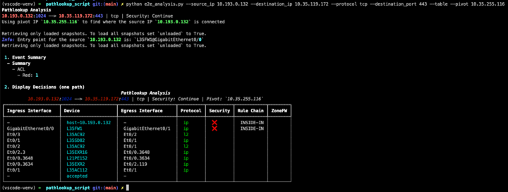
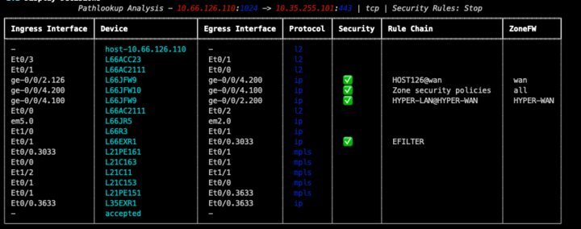

# Pathlookup Analysis Tool

This repository contains a Python script for analyzing Pathlookup and displaying the results.

## Introduction

The Pathlookup Analysis Tool is used to analyze network path between a source and destination IP address. It utilizes the Pathlookup service to retrieve and display the path information.

## Prerequisites

- Python 3.8 or above is required to run this script. Please make sure you have the appropriate version of Python installed on your system.

## Dependencies

The following dependencies are required to run the script, including a python version 3.8+

- `ipfabric`
- `ipfabric-diagrams`
- `ipaddress`
- `dotenv`
- `typer`
- `rich`

Please make sure to install these dependencies before running the script.

## Installation

To install the required dependencies, run the following command:

```shell
pip install ipfabric ipfabric-diagrams ipaddress python_dotenv typer rich
```

## Usage

The script accepts several command-line arguments to customize the analysis. Here are the available options:

- --source_ip or -s: Enter the source IPv4 address or subnet.
- --destination_ip or-d: Enter the destination IPv4 address or subnet.
- --protocol or -p: Enter the protocol (tcp, udp, icmp).
- --destination_port or -dp: Enter the destination ports (udp, tcp).
- --source_port or -sp: Enter the source ports (udp, tcp).
- --ttl or -ttl: Enter the Time To Live (TTL).
- --fragment_offset or -fo: Enter the Fragment Offset.
- --secure_path or -sec: Secure the path: stop the flow when hitting security rules.
- --l2_exclusion or -l2: Remove L2 from the displayed path.
- --pivot or -pivot: Enter the Pivot IPv4 address.
- --table or -t: Display result in a table format.
- --verbose or -v: Enable verbose mode.
- --file or -f: JSON file containing Pathlookup output \*testing purposes only\*

To run the script, use the following command:

```shell
python e2e_analysis.py --source_ip 192.168.1.10 --destination_ip 8.8.8.8 --protocol icmp
```

```shell
python e2e_analysis.py --source_ip 192.168.1.10 --destination_ip 10.48.115.12 --protocol tcp --source_port 1024 --destination_port 443 --secure_path --table
```

Replace the IP addresses and protocol with your desired values.

## Output

The script will display the analysis results, including the path information, event summary, and decisions made.
Additional Information

- When using the ICMP protocol, the --destination_port and --source_port options will not be used.
- The --secure_path option can be used to secure the path and stop the flow when hitting security rules.
- The --l2_exclusion option can be used to remove Layer 2 information from the displayed path.
- The --pivot option is used to find where the source IP is connected using a pivot IP.




Feel free to explore different options and customize the analysis based on your needs.

## Limitations / Future development

- Only one path is provided in the output, in case multiple paths are present, the script will always follow the first choice possible as the next hop. No information will be showing in the table regarding ECMP. It also means, if a FW is present only on one path, but not on another, it may not be represented.
- Multiple ports or IPs as part of the input may not be correctly represented. For example, if you want to see the flow opening result for destination port 80,443 the output will not differentiate which one is allowed/denied.
